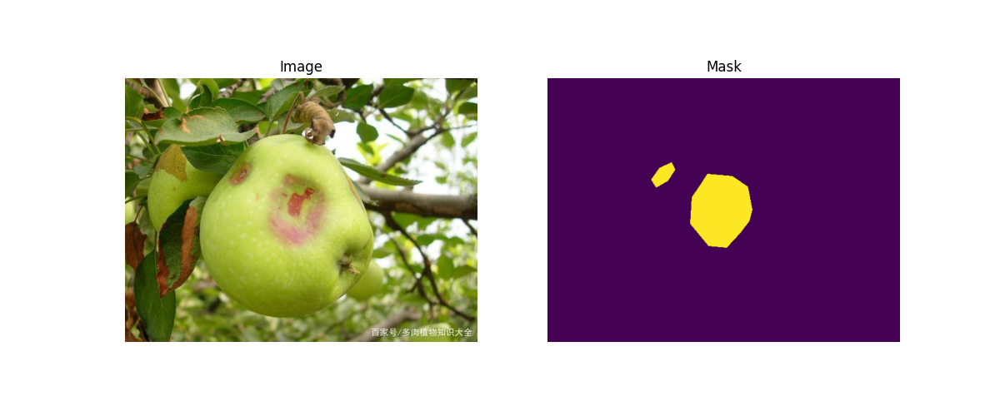

# 基于 CAT-Seg 的病虫害语义分割
**其他语言版本: [English](README_EN.md), [中文](README.md).**
## 1. 项目简介

本项目基于 CAT-Seg 模型完成农业病虫害图像语义分割任务。

目标：

输入：农作物病虫害图片
输出：像素级病虫害区域分割结果

数据集包含：

26 类病虫害
1 类背景
共: 27classes

_数据集并未上传_

本实验数据集共包含27个语义类别，其中0表示背景类别(background)，1-26表示不同病虫害类别。

| ID | Category | ID | Category |
|----|----------|----|----------|
| 0 | background | 14 | bell pepper blossom end rot |
| 1 | Aleurocanthus spiniferus | 15 | citrus canker |
| 2 | Ceroplastes rubens | 16 | corn gray leaf spot |
| 3 | Icerya purchasi Maskell | 17 | corn rust |
| 4 | Limacodidae | 18 | corn smut |
| 5 | Locustoidea | 19 | garlic rust |
| 6 | Potosiabre vitarsis | 20 | legume blister beetle |
| 7 | alfalfa plant bug | 21 | oides decempunctata |
| 8 | aphids | 22 | rice blast |
| 9 | apple black rot | 23 | tarnished plant bug |
| 10 | banana anthracnose | 24 | wheat leaf rust |
| 11 | banana black leaf streak | 25 | wheat loose smut |
| 12 | bean halo blight | 26 | wheat septoria blotch |
| 13 | wheat stripe rust | | |

## 2. 实验环境
### 服务器配置
  本实验模型运行于Autodl平台vGPU-32GB服务器
  | 项目 | 配置|
  |-----|-----|
  | OS | Ubuntu 20.04.3 LTS |
  | CPU | 12 vCPU Intel Xeon Platinum 8352V |
  | GPU | NVIDIA RTX4080 32GB |
  | Ram | 62GB |
  | CUDA | 13.0 |
  | Python | 3.8.20 |
### 辅助设备配置
  | 项目 | 配置|
  |-----|-----|
  | OS | Windows 10 Professional 22H2 |
  | CPU | Intel Core Ultra 9 275HX 2.70 GHz |
  | GPU |  NVIDIA GeForce RTX 5070 Laptop GPU 8 GB |
  | Ram | 16GB |
  | CUDA | 13.1 |
  | Python | 3.10.20 |
## 3. 基础环境安装
### 3.1 环境配置
  ```bash
# 创建环境
conda create -n catseg python=3.8

 # 初始化 conda 到 bash (Autodl)
 conda init bash

 # 重载配置 (Autodl)
 source /root/.bashrc

# 激活环境
conda activate catseg

# 进入项目目录
cd ~/autodl-tmp/CAT-Seg
```
### 3.2 PyTorch环境
安装
```bash
pip install torch==2.0.1 torchvision==0.15.2 torchaudio==2.0.2
```
运行
```bash
python -c "import torch;print(torch.__version__)"
```
输出
```text
2.4.1+cu118
```


### 3.3 获取CAT-Seg代码

```bash
git clone https://github.com/cvlab-kaist/CAT-Seg.git

cd CAT-Seg
```

```text
CAT-Seg
│
├── cat_seg
├── configs
├── datasets
├── train_net.py
├── eval.sh
└── requirements.txt
```
### 3.4 配置环境依赖
运行
```bash
pip install -r requirements.txt
```

requirements:
```text
scipy
ftfy
opencv-python
setuptools
pillow
imageio
timm
regex
einops
```
### 3.5 open_clip配置
  CAT-Seg 需要 open_clip，因为 CAT-Seg 本身依赖 CLIP（Contrastive Language-Image Pre-training）进行开放词汇语义分割（Open-Vocabulary Semantic Segmentation）。
  ```text
                图片
                 ↓
          Image Encoder
                 |
             图像特征
                 |
                 ↓
            相似度计算
                 ↑
           |Text Encoder|
                 |
        "apple black rot"
        "corn rust"
        "aphids"
```
安装
```bash
pip install open_clip_torch
```
验证
```bash
python -c "import open_clip"
```

## 4. 数据集处理
工作目录:
```text
./autodl-tmp/dataset5
```

### 4.1 原始数据格式
Labelme格式:
```text
dataset5
│
├── train
│   ├── images
│   └── labels
│
├── val
│   ├── images
│   └── labels
│
└── test
    ├── images
    └── labels
```
json示例:
```text
{
"label":"apple black rot",
"shape_type":"polygon",
"points":[
 [203.26,164.89],
 [188.72,185.59]
]
}
```
因此我们要转换为CAT-Seg所需求格式

### 4.2 格式转换
工作目录:
```text
./autodl-tmp/dataset5
```
#### 4.2.1 生成类别文件
确定类的数量，统计类别
创建：
```bash
count_classes.py
```

<details>
  <summary>count_classes.py</summary>
  
```python
import os
import json

root = ""

classes = set()

for split in ["train","val","test"]:

    label_dir = os.path.join(
        root,
        split,
        "labels"
    )

    for file in os.listdir(label_dir):

        if file.endswith(".json"):

            path=os.path.join(
                label_dir,
                file
            )

            with open(path,"r",encoding="utf-8") as f:
                data=json.load(f)

            for obj in data["shapes"]:
                classes.add(obj["label"])

print("classes:")

for i,c in enumerate(sorted(classes)):

    print(i+1,c)

```

</details>

运行:
```bash
python get_classes.py
```
<details>
  
<summary>Output</summary>

```text
classes:
1 Aleurocanthus spiniferus
2 Ceroplastes rubens
3 Icerya purchasi Maskell
4 Limacodidae
5 Locustoidea
6 Potosiabre vitarsis
7 alfalfa plant bug
8 aphids
9 apple black rot
10 banana anthracnose
11 banana black leaf streak
12 bean halo blight
13 bell pepper blossom end rot
14 citrus canker
15 corn gray leaf spot
16 corn rust
17 corn smut
18 garlic rust
19 legume blister beetle
20 oides decempunctata
21 rice blast
22 tarnished plant bug
23 wheat leaf rust
24 wheat loose smut
25 wheat septoria blotch
26 wheat stripe rust
```
</details>

#### 4.2.2 Labelme → CAT-Seg mask转换
安装：
```bash
pip install pillow numpy opencv-python
```
创建:
```text
exchange.py
```
<details>
  <summary>exchange.py</summary>
  
```python
import os
import json
import cv2
import numpy as np
from PIL import Image

# 原始数据
src_root=""

# 输出目录
out_root="CATSeg_dataset"

classes=[
    "Aleurocanthus spiniferus",
    "Ceroplastes rubens",
    "Icerya purchasi Maskell",
    "Limacodidae",
    "Locustoidea",
    "Potosiabre vitarsis",
    "alfalfa plant bug",
    "aphids",
    "apple black rot",
    "banana anthracnose",
    "banana black leaf streak",
    "bean halo blight",
    "bell pepper blossom end rot",
    "citrus canker",
    "corn gray leaf spot",
    "corn rust",
    "corn smut",
    "garlic rust",
    "legume blister beetle",
    "oides decempunctata",
    "rice blast",
    "tarnished plant bug",
    "wheat leaf rust",
    "wheat loose smut",
    "wheat septoria blotch",
    "wheat stripe rust"
]

# 类别编号
class_map={
    name:i+1
    for i,name in enumerate(classes)
}

for split in ["train","val","test"]:

    img_dir=os.path.join(
        src_root,
        split,
        "images"
    )

    label_dir=os.path.join(
        src_root,
        split,
        "labels"
    )

    out_img_dir=os.path.join(
        out_root,
        "images",
        split
    )

    out_mask_dir=os.path.join(
        out_root,
        "masks",
        split
    )

    os.makedirs(
        out_img_dir,
        exist_ok=True
    )

    os.makedirs(
        out_mask_dir,
        exist_ok=True
    )

    for json_file in os.listdir(label_dir):

        if not json_file.endswith(".json"):
            continue

        json_path=os.path.join(
            label_dir,
            json_file
        )

        with open(
            json_path,
            "r",
            encoding="utf-8"
        ) as f:

            data=json.load(f)

        h=data["imageHeight"]
        w=data["imageWidth"]

        mask=np.zeros(
            (h,w),
            dtype=np.uint8
        )

        for shape in data["shapes"]:

            label=shape["label"]

            if label not in class_map:
                continue

            points=np.array(
                shape["points"],
                dtype=np.int32
            )

            cv2.fillPoly(
                mask,
                [points],
                class_map[label]
            )
        # 保存mask

        name=os.path.splitext(
            json_file
        )[0]

        mask_path=os.path.join(
            out_mask_dir,
            name+".png"
        )

        Image.fromarray(mask).save(
            mask_path
        )
        # 复制图片

        img_name=data["imagePath"]

        src_img=os.path.join(
            img_dir,
            img_name
        )

        dst_img=os.path.join(
            out_img_dir,
            img_name
        )

        if os.path.exists(src_img):

            Image.open(src_img).save(
                dst_img
            )
print("Done!")
```
</details>

运行:
```bash
python exchange.py
```
输出:
```text
Done~
```
创建classes.txt

<details>
  <summary>classes.txt</summary>
  
  ```text
background
Aleurocanthus spiniferus
Ceroplastes rubens
Icerya purchasi Maskell
Limacodidae
Locustoidea
Potosiabre vitarsis
alfalfa plant bug
aphids
apple black rot
banana anthracnose
banana black leaf streak
bean halo blight
bell pepper blossom end rot
citrus canker
corn gray leaf spot
corn rust
corn smut
garlic rust
legume blister beetle
oides decempunctata
rice blast
tarnished plant bug
wheat leaf rust
wheat loose smut
wheat septoria blotch
wheat stripe rust
```
  
</details>

创建 mask 可视化脚本
check_mask.py

_(注:可修改图片路径)_
<details>
  <summary>check_mask.py</summary>
  
  ```python
from PIL import Image
import numpy as np
import matplotlib.pyplot as plt
import os


# 修改这里，选择一张存在的图片
img_path = r"CATSeg_dataset/images/train/apple_black_rot_1_jpg.rf.e21dee4a83b8d37c916ed9d2dc1b2896.jpg"

mask_path = r"CATSeg_dataset/masks/train/apple_black_rot_1_jpg.rf.e21dee4a83b8d37c916ed9d2dc1b2896.png"


img = Image.open(img_path)

mask = np.array(
    Image.open(mask_path)
)


plt.figure(figsize=(12,5))


plt.subplot(1,2,1)
plt.imshow(img)
plt.title("Image")
plt.axis("off")


plt.subplot(1,2,2)
plt.imshow(mask)
plt.title("Mask")
plt.axis("off")


plt.show()


print("mask类别:", np.unique(mask))
```

</details>

Output



```text

mask类别: [0 x]

```
x为classes.txt中类别编号1~26
如输出：
```text
mask类别: [0 9]
```
表示：9 = apple black rot

## 服务器目录结构

工作目录:
```text
./autodl-tmp/CAT-seg
```
现在整体目录结构
```text
autodl-tmp
├── CAT_Seg
|         │
│         ├── cat_seg
│         ├── configs
│         ├── datasets
│         ├── train_net.py
│         ├── eval.sh
│         └── requirements.txt
│
└── dataset5
          ├── CATSeg_dataset
          │            │
          │            ├── images
          │            │   ├── train
          │            │   ├── val
          │            │   └── test
          │            │
          │            ├── masks
          │            │   ├── train
          │            │   ├── val
          │            │   └── test
          │            │
          │            └── classes.txt
          │
          ├── count_classes.py
          │
          ├── exchange.py
          │
          └── check_mask.py
```
## 5.数据集注册
Detectron2 默认只支持：COCO，VOC，ADE20K等公开数据集。
因此在
```text
CAT-Seg
│
└── cat_seg
    │
    └── data
        │
        └── datasets
            │
            └── register_pest.py
```
创建
```text
register_pest.py
```

<details>
  <summary>register_pest.py</summary>
  
  ```python
  from detectron2.data import DatasetCatalog, MetadataCatalog
from detectron2.data.datasets import load_sem_seg


_PREDEFINED_SPLITS_PEST = {
    "pest_train": (
        "/root/autodl-tmp/dataset5/CATSeg_dataset/images/train",
        "/root/autodl-tmp/dataset5/CATSeg_dataset/masks/train",
    ),

    "pest_val": (
        "/root/autodl-tmp/dataset5/CATSeg_dataset/images/val",
        "/root/autodl-tmp/dataset5/CATSeg_dataset/masks/val",
    ),

    "pest_test": (
        "/root/autodl-tmp/dataset5/CATSeg_dataset/images/test",
        "/root/autodl-tmp/dataset5/CATSeg_dataset/masks/test",
    ),
}


def register_all_pest(root=None):

    for name, (image_dir, gt_dir) in _PREDEFINED_SPLITS_PEST.items():

        DatasetCatalog.register(
            name,
            lambda x=image_dir, y=gt_dir:
            load_sem_seg(
                y,
                x,
                gt_ext="png",
                image_ext="jpg"
            )
        )


        MetadataCatalog.get(name).set(
            ignore_label=255,
            evaluator_type="sem_seg",
            stuff_classes=[
                "background",
                "Aleurocanthus spiniferus",
                "Ceroplastes rubens",
                "Icerya purchasi Maskell",
                "Limacodidae",
                "Locustoidea",
                "Potosiabre vitarsis",
                "alfalfa plant bug",
                "aphids",
                "apple black rot",
                "banana anthracnose",
                "banana black leaf streak",
                "bean halo blight",
                "bell pepper blossom end rot",
                "citrus canker",
                "corn gray leaf spot",
                "corn rust",
                "corn smut",
                "garlic rust",
                "legume blister beetle",
                "oides decempunctata",
                "rice blast",
                "tarnished plant bug",
                "wheat leaf rust",
                "wheat loose smut",
                "wheat septoria blotch",
                "wheat stripe rust",
            ]
        )

register_all_pest()

```
</details>

### 注册文件导入

修改
```text
cat_seg/data/datasets/__init__.py
```
加入
```python
from .register_pest import register_all_pest
```
作用：让 CAT-Seg 加载数据模块时可以找到自己的数据集。

### 在训练入口调用注册函数

修改
```text
./autodl-tmp/CAT-Seg/train_net.py
```
在main中添加：
```python
register_all_pest()
```
### 验证注册是否成功

创建
```text
test_dataset.py
```

<details>
  <summary>test_dataset.py</summary>

  ```python
from detectron2.data import DatasetCatalog
import cat_seg.data.datasets


print(
    DatasetCatalog.get("pest_train")[:1]
)
```
  
</details>

首次运行时，若成功注册，会出现形如
```text
[
{
'file_name':
'/root/autodl-tmp/dataset5/CATSeg_dataset/images/train/IP024000016.jpg',

'sem_seg_file_name':
'/root/autodl-tmp/dataset5/CATSeg_dataset/masks/train/IP024000016.png'
}
]
```

说明图片和mask已经正确匹配。

再次运行时，则会出现报错

```text
AssertionError: Dataset 'pest_train' is already registered!

```
## 6.训练配置修改
### 6.1 创建类别文件
创建
```text
datasets/pest27.json
```
<details>
  <summary>pest27.json</summary>
  
  ```json
[
"background",
"Aleurocanthus spiniferus",
"Ceroplastes rubens",
"Icerya purchasi Maskell",
"Limacodidae",
"Locustoidea",
"Potosiabre vitarsis",
"alfalfa plant bug",
"aphids",
"apple black rot",
"banana anthracnose",
"banana black leaf streak",
"bean halo blight",
"bell pepper blossom end rot",
"citrus canker",
"corn gray leaf spot",
"corn rust",
"corn smut",
"garlic rust",
"legume blister beetle",
"oides decempunctata",
"rice blast",
"tarnished plant bug",
"wheat leaf rust",
"wheat loose smut",
"wheat septoria blotch",
"wheat stripe rust"
]

  ```

</details>

### 6.2 创建训练配置

复制原始配置
```bash
cd ~/autodl-tmp/CAT-Seg/configs

cp vitb_384.yaml pest_vitb_384.yaml
```
修改：
```text
pest_vitb_384.yaml
```
中
```yaml
SEM_SEG_HEAD:
  NUM_CLASSES: 171
  TRAIN_CLASS_JSON: "datasets/coco.json"
  TEST_CLASS_JSON: "datasets/coco.json"
```
几项修改为
```yaml
SEM_SEG_HEAD:
  NUM_CLASSES: 27
  TRAIN_CLASS_JSON: "datasets/pest27.json"
  TEST_CLASS_JSON: "datasets/pest27.json"
```
要在 pest_vitb_384.yaml 中添加数据集名称
即在末尾添加
```yaml
DATASETS:
  TRAIN: ("pest_train",)
  TEST: ("pest_val",)
```
根据实际情况修改
```yaml
MAX_ITER: 50000
```
## 7.开始训练

### 测试
先跑100 iteration，检查：CLIP权重,dataloader,loss,GPU显存,mask尺寸

```bash
python train_net.py \
--config-file configs/pest_vitb_384.yaml \
SOLVER.MAX_ITER 100 \
--num-gpus 1
```

### 正式训练
```bash
python train_net.py \
--config-file configs/pest_vitb_384.yaml \
--num-gpus 1
```
### 训练结果
模型评价指标

CAT-Seg属于：semantic segmentation

| 指标 | 含义 |
|---|---|
| mIoU | 主要语义分割指标 |
| fwIoU | 类别面积加权 IoU |
| pACC | 像素准确率 |
| Mask AP<sub>50</sub> | IoU=0.5 下的 Mask AP |
| Mask AP<sub>50-95</sub> | IoU 0.5~0.95 平均 Mask AP |

| Iteration | mIoU | fwIoU | mACC | pACC | Mask AP<sub>50</sub> | Mask AP<sub>50-95</sub> |
|----|----|----|----|----|----|----|
| 100 | 2.4589 | 3.5563 | 18.3378 | 5.8825 | unknow | unknow |
| 22000 | 59.6129 | 89.5649 | 72.5572 | 93.8348 | unknow | unknow |
| 50000 | unknow | unknow | unknow | unknow | unknow | unknow |

### _注_ :Mask AP评估

由于本数据集提供的是语义分割标注，
在进行COCO评估之前，通过连通域分析方法将语义分割预测结果转换为实例掩码。

因此，本文报告的mask AP指标表示由语义分割预测结果转换得到的实例级评估结果。

## 8. 最终实验记录
训练完成保存：
```text
output/
│
├── model_final.pth
├── log.txt
└── inference/
```

## 致谢

这个项目基于 [CAT-Seg](https://github.com/cvlab-kaist/CAT-Seg)

感谢CAT-Seg作者们的出色工作


